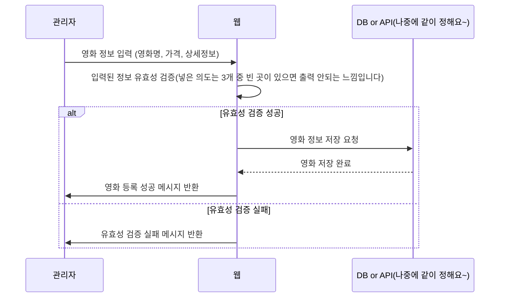
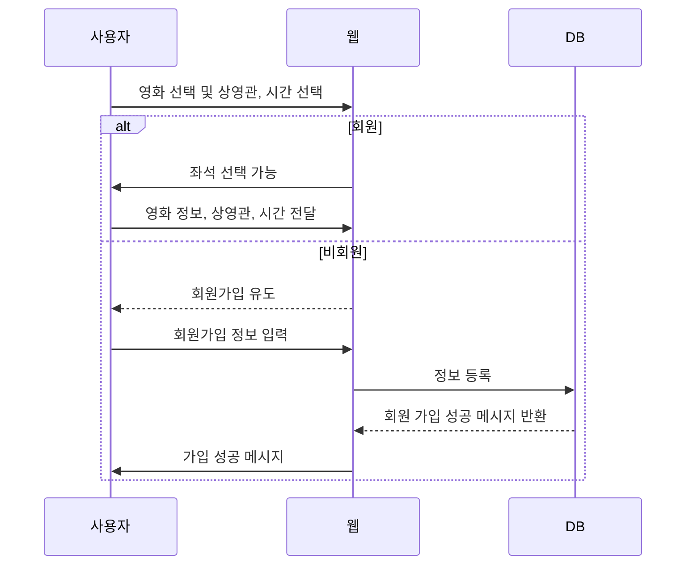
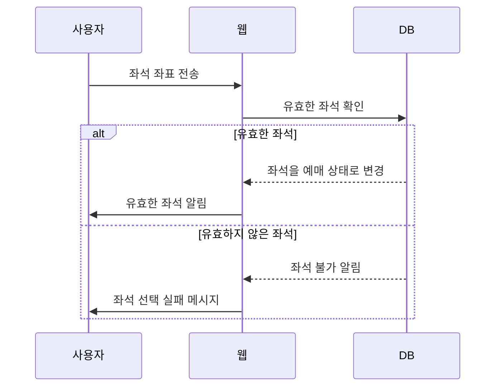
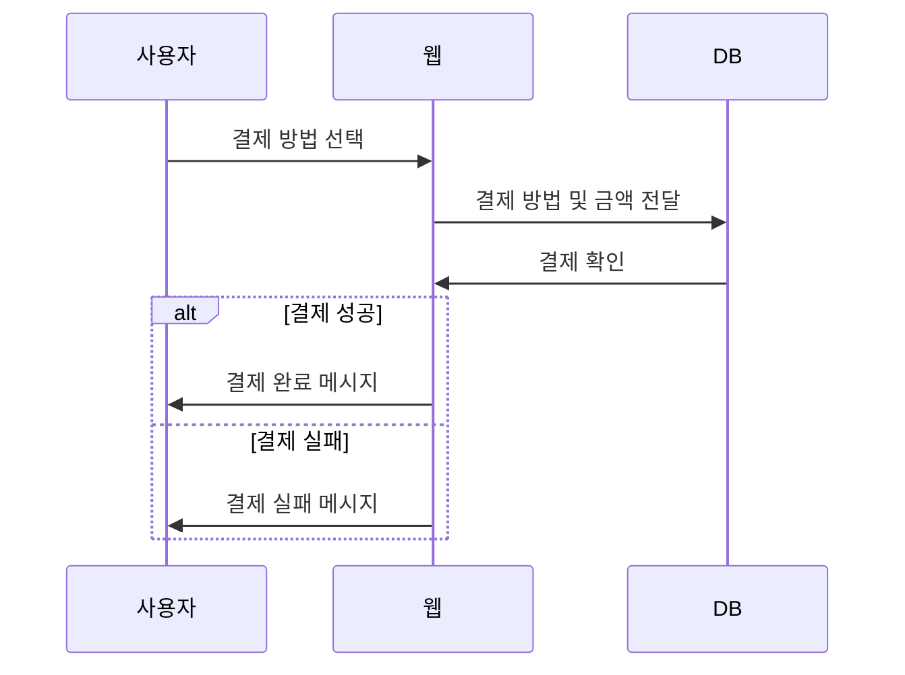
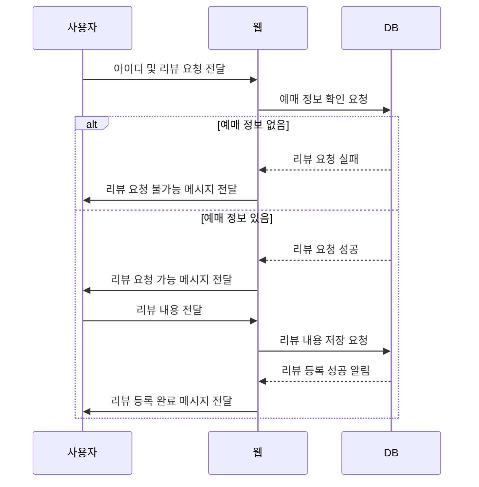

# NBE2_2_Team6
가상의 극장을 운영하는 영화관 서비스입니다.

<div align=center><h1>📚 STACKS</h1></div>
<div align=center> 
  
  
  <br>
  
  
  
  
  
  
  <br>

  <div style="display: inline-block; border-radius: 50%; padding: 20px; border: 2px solid #ccc; text-align: center; width: 250px;">
    <div style="font-weight: bold; margin-bottom: 10px;">협업툴</div>
    
    
    
  </div>
  <br>
</div>


## 영화 정보 등록 



## 영화 선택


## 좌석 선택


## 결제

## 리뷰

## 가상계좌 결제
## Virtual Account Payment Flow

```mermaid
sequenceDiagram
    participant Buyer as 구매자
    participant Client
    participant Server
    participant PaymentGateway as 토스페이먼츠

    Buyer->>PaymentGateway: 가상계좌 발급 요청
    PaymentGateway-->>Client: SuccessUrl 이동 (점선)
    Client->>Server: 가상계좌 발급 요청
    Server->>PaymentGateway: 승인 API 요청
    PaymentGateway-->>Server: 가상계좌 발급 결과 응답
    Server--..>>Client: 가상계좌 정보 응답 (희미한 점선)
    Buyer->>PaymentGateway: 가상계좌 입금
    PaymentGateway->>Server: 입금 완료 통보
    Server->>Client: 결제 결과 안내
    Client-->>Buyer: 결제 결과 안내
```

