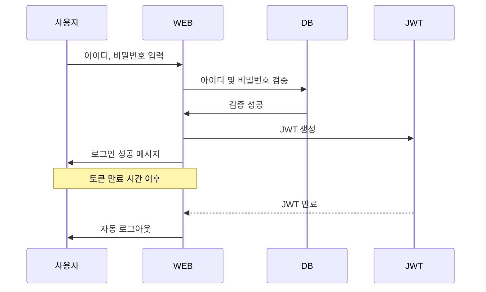
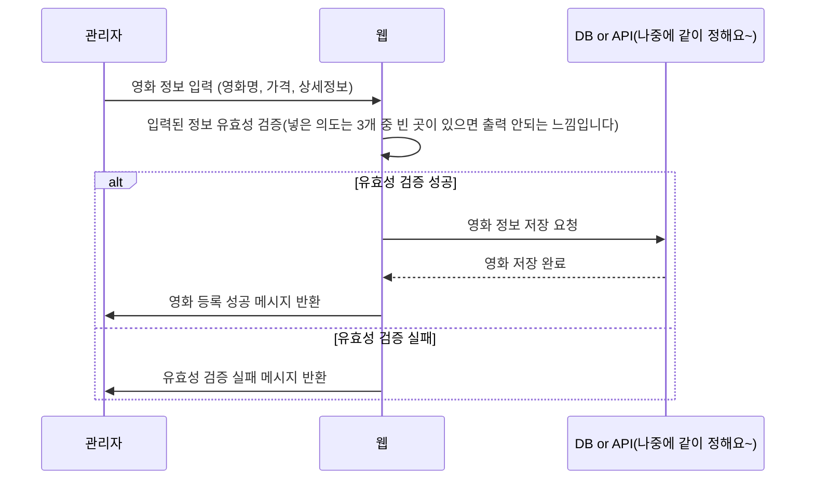
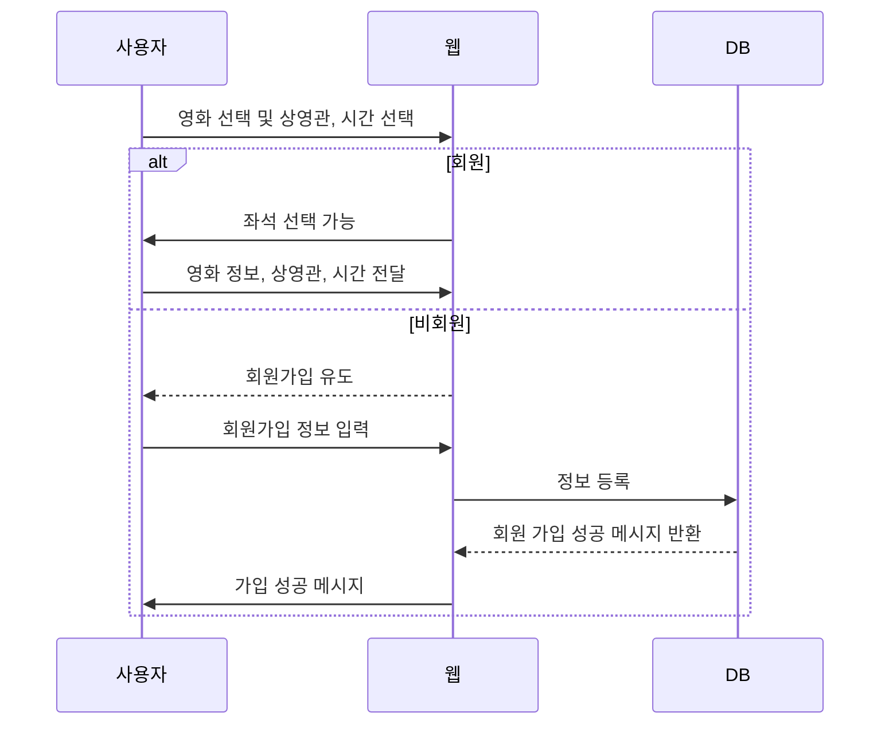
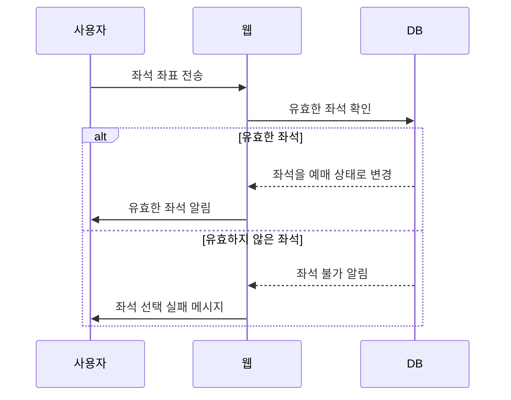
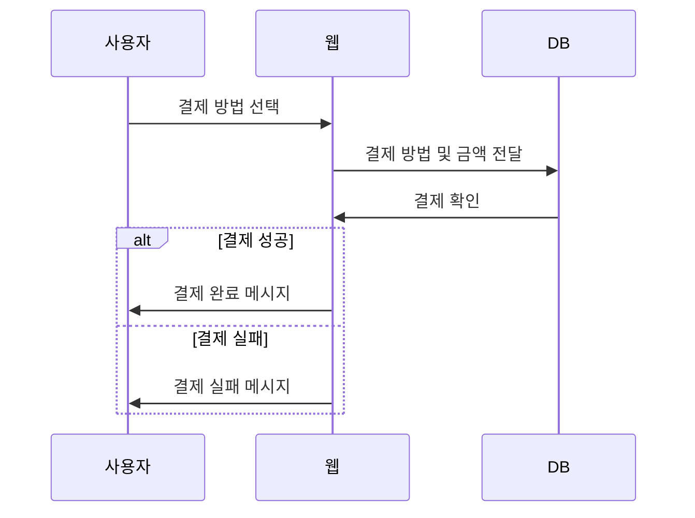
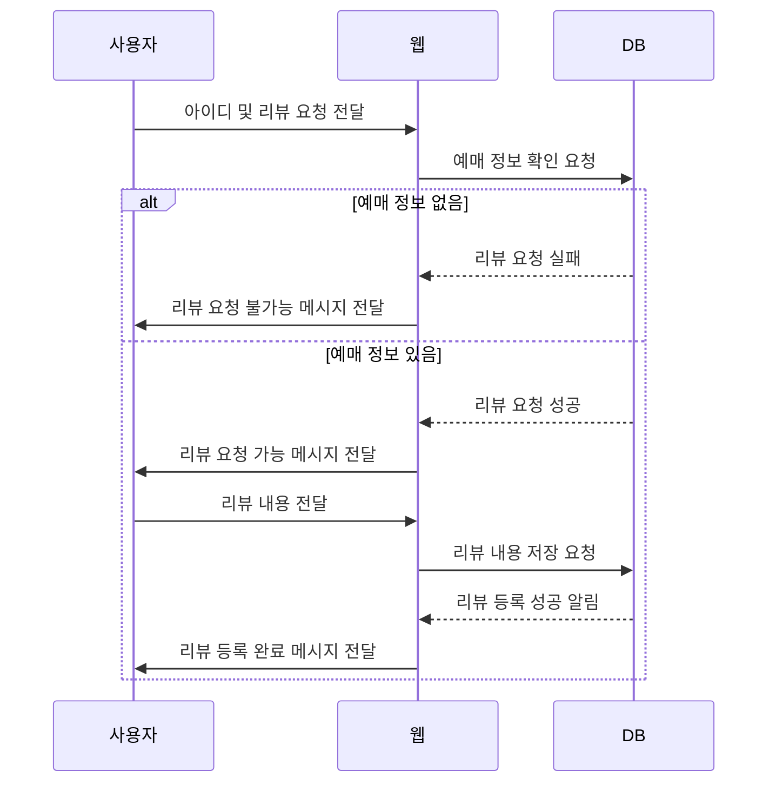

# NBE2_2_Team6
가상의 극장을 운영하는 영화관 서비스입니다.

## 예시 예시

```mermaid
sequenceDiagram
    participant User as 사용자
    participant WebApp as WEB
    participant DB as DB
    participant JWT as JWT
    
    User ->> WebApp: 아이디, 비밀번호 입력
    WebApp ->> DB: 아이디 및 비밀번호 검증
    DB ->> WebApp: 검증 성공
    WebApp ->> JWT: JWT 생성
    WebApp ->> User: 로그인 성공 메시지
    
    Note over WebApp, User: 토큰 만료 시간 이후
    
    JWT -->> WebApp: JWT 만료
    WebApp ->> User: 자동 로그아웃
``` 

## 영화 정보 등록 

```mermaid
sequenceDiagram
    participant Admin as 관리자
    participant WebApp as 웹
    participant DB as DB or API(나중에 같이 정해요~)

    Admin ->> WebApp: 영화 정보 입력 (영화명, 가격, 상세정보)
    WebApp ->> WebApp: 입력된 정보 유효성 검증(넣은 의도는 3개 중 빈 곳이 있으면 출력 안되는 느낌입니다)
    alt 유효성 검증 성공
        WebApp ->> DB: 영화 정보 저장 요청
        DB -->> WebApp: 영화 저장 완료
        WebApp ->> Admin: 영화 등록 성공 메시지 반환
    else 유효성 검증 실패
        WebApp ->> Admin: 유효성 검증 실패 메시지 반환
    end
```

## 영화 선택

```mermaid
sequenceDiagram
    participant User as 사용자
    participant WebApp as 웹
    participant DB as DB

    User ->> WebApp: 영화 선택 및 상영관, 시간 선택
    alt 회원
        WebApp ->> User: 좌석 선택 가능
        User ->> WebApp: 영화 정보, 상영관, 시간 전달
    else 비회원
        WebApp -->> User: 회원가입 유도
        User ->> WebApp: 회원가입 정보 입력
        WebApp ->> DB: 정보 등록
        DB -->> WebApp: 회원 가입 성공 메시지 반환
        WebApp ->> User: 가입 성공 메시지
    end
```

## 좌석 선택

```mermaid
sequenceDiagram
    participant User as 사용자
    participant WebApp as 웹
    participant DB as DB

    User ->> WebApp: 좌석 좌표 전송
    WebApp ->> DB: 유효한 좌석 확인
    alt 유효한 좌석
        DB -->> WebApp: 좌석을 예매 상태로 변경
        WebApp ->> User: 유효한 좌석 알림
    else 유효하지 않은 좌석
        DB -->> WebApp: 좌석 불가 알림
        WebApp ->> User: 좌석 선택 실패 메시지
    end

```

## 결제

```mermaid
sequenceDiagram
    participant User as 사용자
    participant WebApp as 웹
    participant DB as DB

    User ->> WebApp: 결제 방법 선택
    WebApp ->> DB: 결제 방법 및 금액 전달
    DB ->> WebApp: 결제 확인
    alt 결제 성공
        WebApp ->> User: 결제 완료 메시지
    else 결제 실패
        WebApp ->> User: 결제 실패 메시지
    end
```
## 리뷰

```mermaid
sequenceDiagram
    participant User as 사용자
    participant WebApp as 웹
    participant DB as DB

    User ->> WebApp: 아이디 및 리뷰 요청 전달
    WebApp ->> DB: 예매 정보 확인 요청
    alt 예매 정보 없음
        DB -->> WebApp: 리뷰 요청 실패
        WebApp ->> User: 리뷰 요청 불가능 메시지 전달
    else 예매 정보 있음
        DB -->> WebApp: 리뷰 요청 성공
        WebApp ->> User: 리뷰 요청 가능 메시지 전달
        
        User ->> WebApp: 리뷰 내용 전달
        WebApp ->> DB: 리뷰 내용 저장 요청
        DB -->> WebApp: 리뷰 등록 성공 알림
        WebApp ->> User: 리뷰 등록 완료 메시지 전달
    end
```

